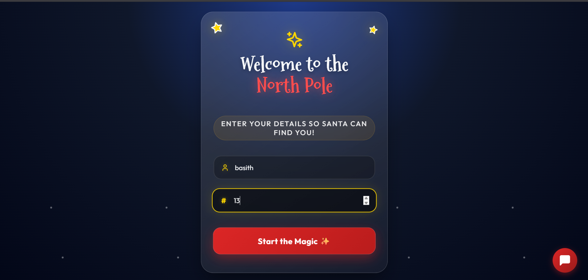
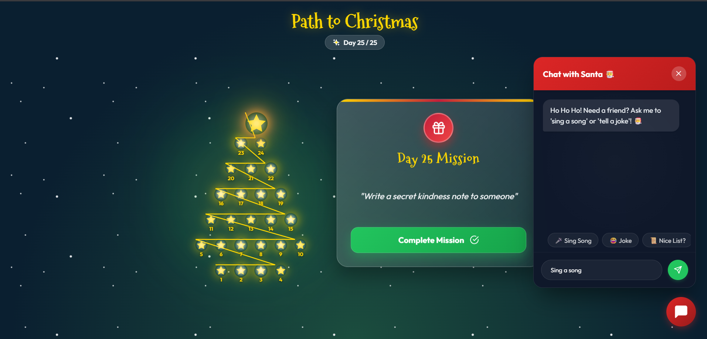
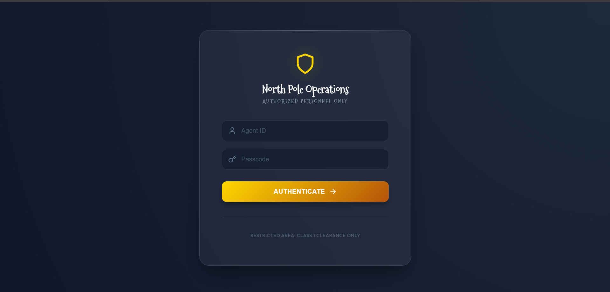
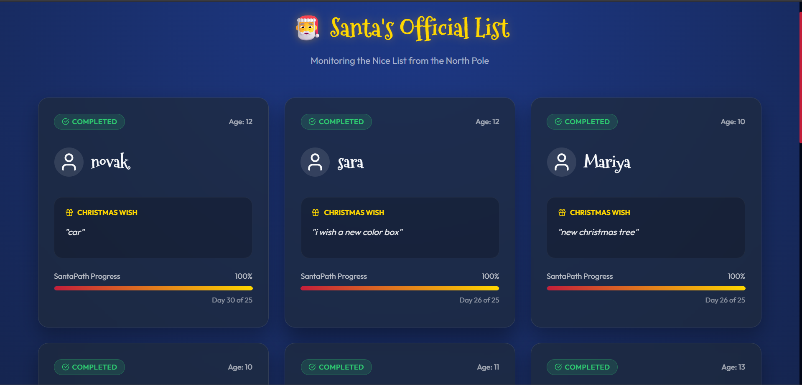
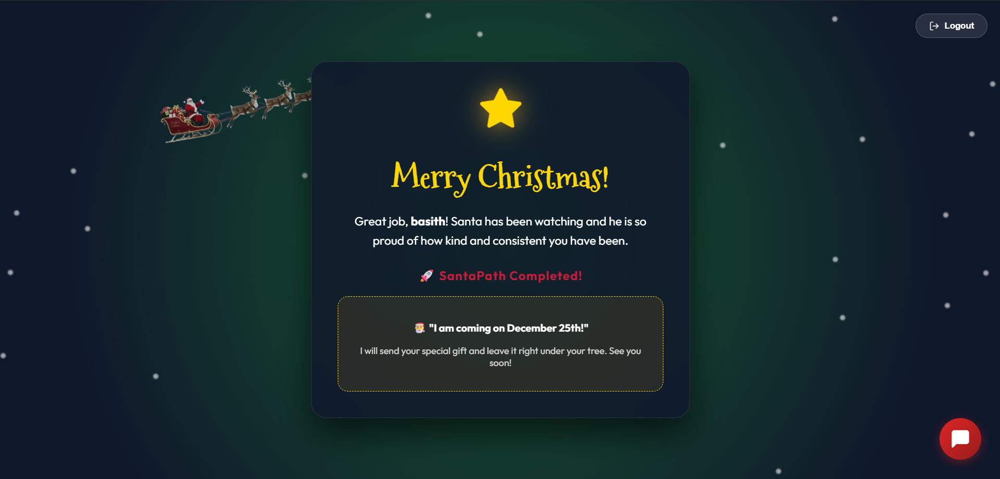
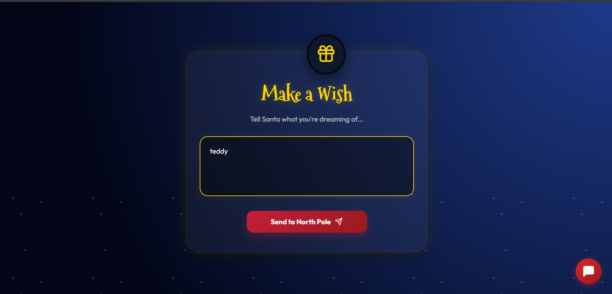

# 🎅 SantaPath - The Magical North Pole Experience

**SantaPath** is an interactive, magical web application designed to bring the joy of Christmas to children. It guides them through a festive journey to the North Pole, complete with daily tasks, a wish list, and a secure portal for Santa himself.

## ✨ Features

### 🌟 For Kids
*   **Magical Onboarding**: A beautiful, snowy welcome screen that personalizes the experience.
*   **Daily Task Tree**: An interactive "Advent Tree" where kids complete daily good deeds to light up stars on their path to Christmas.
*   **Make a Wish**: A visually stunning wish list page where kids can send their Christmas wishes directly to the North Pole (with confetti!).
*   **Talk with Santa**: An integrated Chatbot to sing songs, tell jokes, or check the Nice List status.
*   **Final Message**: A heartwarming custom message from Santa when they complete their journey.

### 🔒 For Santa (Admin)
*   **Secure Portal**: A "Top Secret" login screen protecting sensitive North Pole data.
*   **Santa Dashboard**: A control center to view all registered kids, their progress, and their wishes in real-time.
*   **Live Updates**: See who is being naughty or nice with a staggered, animated list.

---

## 🛠️ Tech Stack

*   **Frontend**: React.js
*   **Animations**: Framer Motion (Complex staggers, entrances, and layout transitions)
*   **Icons**: Lucide React
*   **Styling**: Custom CSS with Glassmorphism & Premium Gradients
*   **Notifications**: SweetAlert2 (Magical custom popups)
*   **Effects**: Canvas Confetti

---

## 🚀 Setup Instructions

### Prerequisites
*   Node.js installed on your machine.

### Installation

1.  **Clone the repository**:
    ```bash
    git clone <repository-url>
    cd santa_path
    ```

2.  **Install Dependencies**:
    ```bash
    npm install
    ```

3.  **Start the Server**:
    (Navigate to the server folder if applicable, otherwise run in root)
    ```bash
    npm start
    ```
    The app will open at `http://localhost:3000`.

4.  **Mobile Access**:
    To access from your phone, ensure your mobile is on the same Wi-Fi and use the Network IP address shown in the terminal (e.g., `http://192.168.1.5:3000`).

---

## 🔑 Santa Portal Credentials

To access the **Santa Dashboard**, use the following "Top Secret" credentials on the Login Page:

| Role | Username | Password |
| :--- | :--- | :--- |
| **Santa Claus** | `santa` | `santa123` |

> *Note: These credentials are strictly for authorized North Pole personnel only.*

---

## 📸 Screenshots

### Landing Page


### Kid Start Page


### Daily Task Page


### Santa Login Page


### Santa Dashboard


### Final Page


### Wish Page



---


